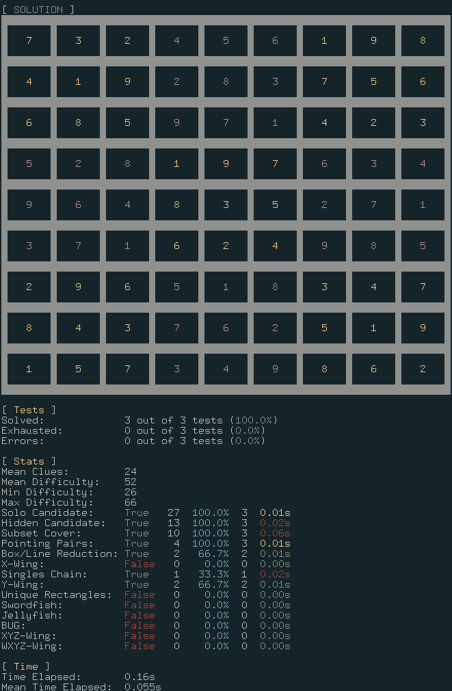
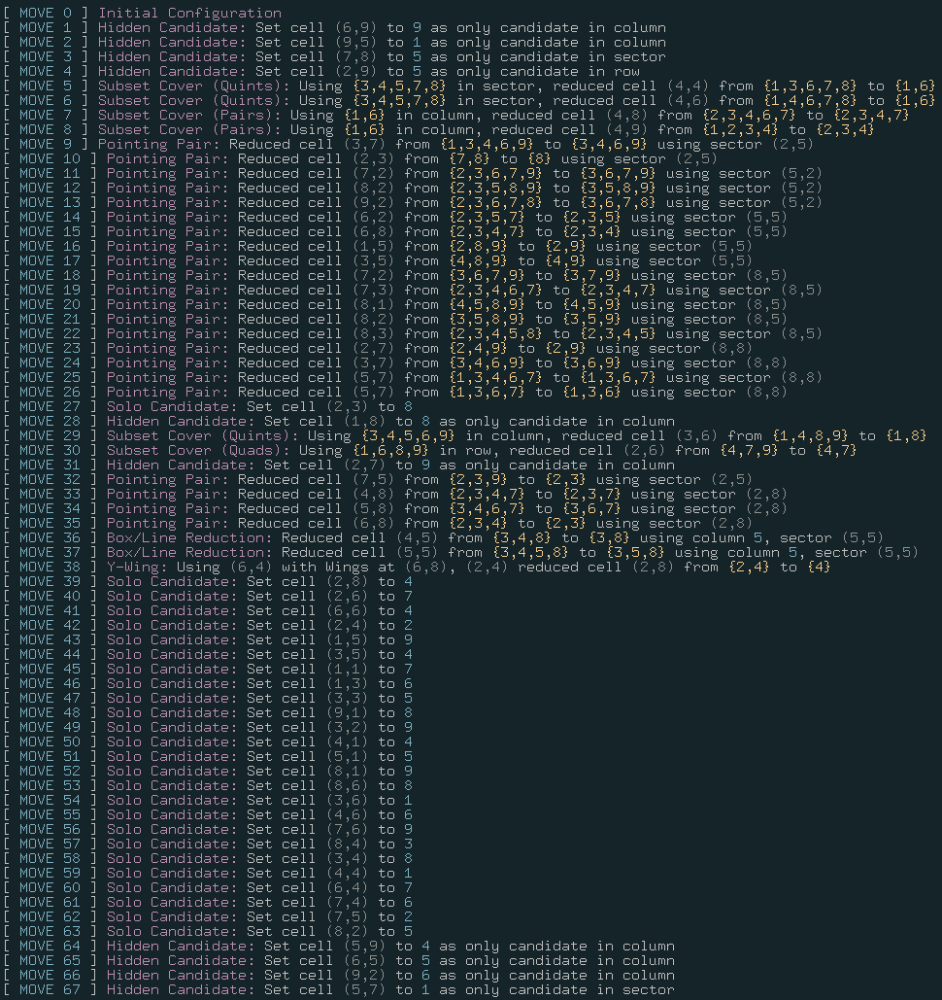

# Logical Sudoku Solver

<br />

CLI logical Sudoku solver that can solve expert level 9x9 Sudoku using only logical techniques and reasoning (in other words no brute forcing, guessing or backtracking). The program outputs a detailed description of the techniques and moves required at each step to solve unique solution Sudoku. The solver reads csv files where each puzzle can be separated by newline characters to allow batch solving. After processing all Sudoku in a given file, in-depth analysis is displayed including but not limited to: difficulty rating, occurrences of each technique, probability of each technique, processing time for each technique and total processing time.

<br />

View additonal information on the logical techniques used [here](https://www.kylegough.co.uk/projects/sudoku).

<br />

<p align='center'>
  
</p>

<br />

## Terminology

* **Candidates** - The possible values a cell can be. Various techniques will aim to reduce to number of candidates for each cell using logical reasoning.
* **Simple Sudoku** - A Sudoku that can be solved only using the solo candidate and hidden candidate techniques.
* **Minimum Sudoku** - A Sudoku where removing a clue from the initial configuration produces a Sudoku without a unique solution. Minimum Sudoku must have at least 17 clues.
* **Conjugate Pair** - Where a candidate is only valid in exactly two cells within a structure, the two cells form a conjugate pair.
* **Weak Pair** - Two cells part of two different conjugate pairs that share the same row, column or sector.

<br />

## Solution Techniques

- Solo Candidate
- Hidden Candidate
- Subset Cover
- Pointing Pairs/Triples
- Box/Line Intersection
- X-Wing
- Singles Chain
- Y-Wing
- Unique Rectangles
- Swordfish
- Jellyfish
- Bi-Value Universal Grave
- XYZ-Wing
- WXYZ-Wing

<br />

## Benchmarking and Testing

### Summary

| Technique                | Tests Passed ( /49,151) | Tests Passed (%) |
| ------------------------ | ----------------------- | ---------------- |
| Solo Candidate           | 0                       | 0                |
| Hidden Candidate         | 21,905                  | 44.6             |
| Subset Cover             | -                       | -                |
| Pointing Pairs           | 41,302                  | 84.0             |
| Box/Line Reduction       | 41,577                  | 84.6             |
| X-Wing                   | 41,594                  | 84.6             |
| Singles Chain            | 44,530                  | 90.6             |
| Y-Wing                   | 45,732                  | 93.0             |
| Unique Rectangles        | -                       | -                |
| Swordfish                | -                       | -                |
| Jellyfish                | -                       | -                |
| Bi-Value Universal Grave | 45,929                  | 93.4             |
| XYZ-Wing                 | -                       | -                |
| WXYZ-Wing                | 46,265                  | 94.1             |

<br />

*Note: Accuracy is determined by applying the corresponding technique and all previous techniques across all 49,151 17-clue Sudokus.*

<br />

### Coverage and Total Occurrences

This table demonstrates the percentage of test puzzles that feature at least one of each technique. Note that some harder techniques could be employed instead of multiple uses of easier techniques in certain Sudoku, however the solver has been implemented to ensure that easier techniques are prioritised over the more difficult techniques. 

<br />

| Technique          | Coverage (%) | Occurrences |
| ------------------ | ------------ | ----------- |
| Solo Candidate     | 98.6         | 384,825     |
| Hidden Candidate   | 100.0        | 271,095     |
| Subset Cover       | 49.0         | 58,202      |
| Pointing Pairs     | 25.3         | 14,211      |
| Box/Line Reduction | 2.7          | 1,416       |
| X-Wing             | 0.8          | 412         |
| Singles Chain      | 8.1          | 4,752       |
| Y-Wing             | 3.0          | 1,279       |
| Unique Rectangles  | -            | -           |
| Swordfish          | 0.2          | 138         |
| Jellyfish          | 0.0          | 7           |
| BUG                | 0.4          | 204         |
| XYZ-Wing           | 0.8          | 419         |
| WXYZ-Wing          | 0.7          | 359         |

<br />

### Datasets

Datasets of different Sudoku puzzles were tested against the solver in order to test completeness, speed and efficiency.

- [Gordon Royle's list of all currently known 17-clue minimal Sudoku puzzles](http://staffhome.ecm.uwa.edu.au/~00013890/sudokumin.php) - used as the primary benchmark as contains a wide range of puzzle difficulties. 17 clues (initial numbers on the grid) is the minimum number of clues any Sudoku can have such that it has a unique solution. Testing all 49,151 puzzles repeatedly is time-consuming, so a subset of 1000 of these puzzles are used for continual testing purposes. Testing of all 49,151 is performed when relevant milestones are reached.
- [1 million Simple Sudoku games](https://www.kaggle.com/bryanpark/sudoku) - the solver successfully solves 100% of the Sudoku in this dataset. A subset of 1000 of these puzzles are used to check for errors during development.


Here is a partially solved Sudoku:

* Cells with only one value (Yellow/Purple) are cells which the value is known to be the value in the cell.

* Cells with one or more values (Blue/Red) are cells which the value could be one of the values in the cell.
* Different colours are used to differentiate between the 3x3 sectors.


## Example Output


At each step the following information is output:

* Techniques used to gain information and what deductions have been made.
* Cells and structures used to gain information.
* Cell(s) it affects.

<div align="center">
  
</div>

<br />

## Running the Solver

Run the solver on 1000 simple Sudoku.

`./sudoku tests/simple-1000.csv`

> The solver will run on .csv files where each 81-character line can represent one puzzle. 0's represent missing/unknown cells and the order of the cells goes from top to bottom, left to right.

<br />

The output should look something like this:

```
[ Tests ]
 - Solved 1000 out of 1000 tests. (100.0%)
```

<br />

There are two optional flags:

* `-m` - Displays the moves and techniques used at each stage of solving the Sudoku.
* `-o` - Displays the initial grid and solution in the terminal.


`./sudoku -m -o tests/simple-1000.csv`
